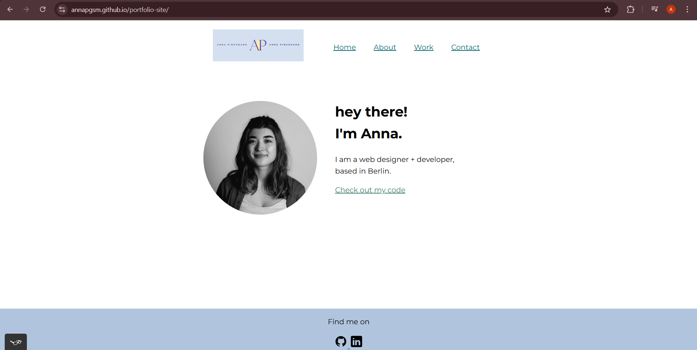
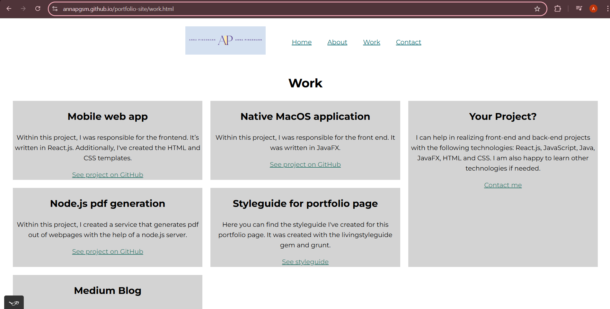

# Anna Pingsmann - Portfolio

This is my personal web developer portfolio built with HTML and CSS. It showcases my work, tells a bit about me, and includes links to contact me.  
This is my first portfolio project and part of my learning journey into front-end development.


## Technologies used

- Html5
- Css
- Vs code
- Git & GitHub
## Set up instructions

git clone https://github.com/annapgsm/portfolio-site.git

cd portfolio-site

## Deployment

To deploy this project run

```bash
  https://annapgsm.github.io/portfolio-site/
```


## Screenshots





